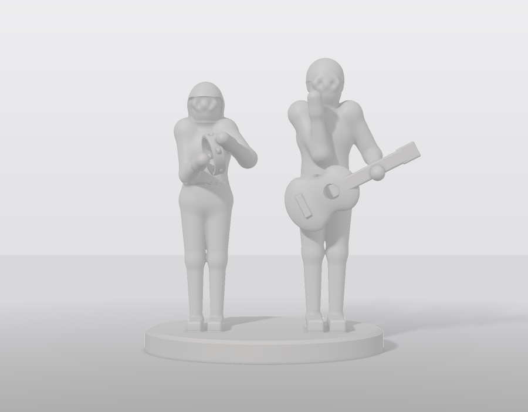
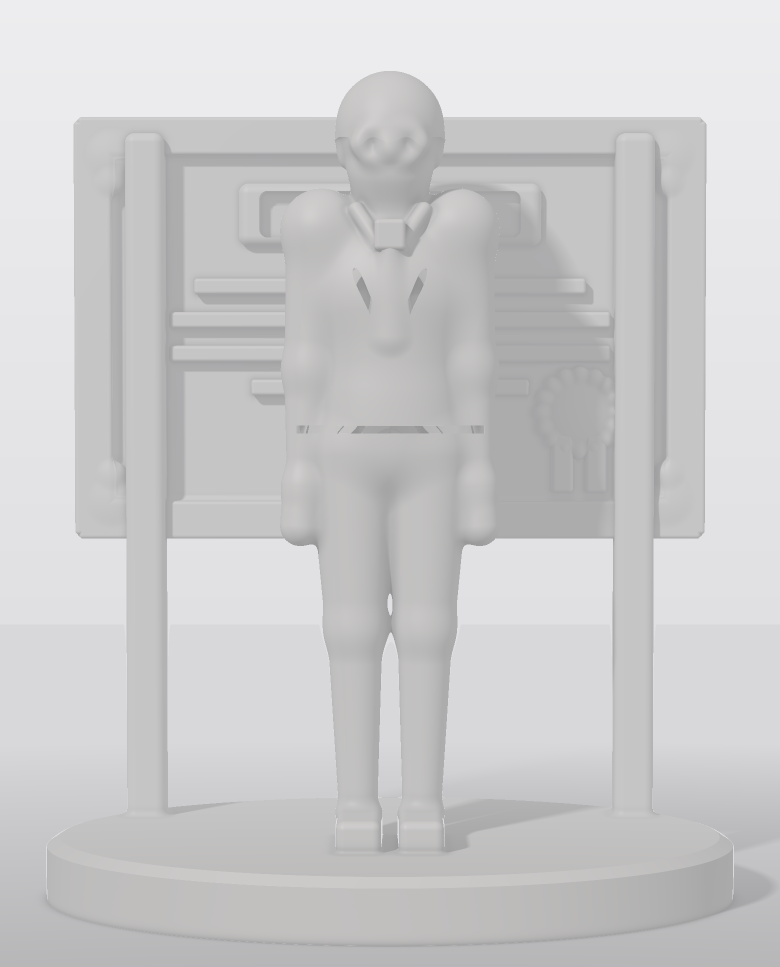

# Dos estatuillas en resina — Elegoo Saturn 4 Ultra 16K

Dos figuras de ~19 cm definidas como **campo analítico** (no como malla
dibujada a mano), ahuecadas para resina, verificadas contra ocho compuertas de
fabricabilidad y costeadas sobre **volumen medido**.

| | Dúo de alabanza | Reconocimiento |
|---|---|---|
| |  |  |
| Caja envolvente | **174.6 × 93.3 × 190.5 mm** | **156.0 × 104.1 × 186.9 mm** |
| Resina (hueca, pared 2.2 mm) | **143.3 ml** | **201.0 ml** |
| Maciza sería | 331.5 ml | 401.7 ml |
| Compuertas | **6/6 · lista para rebanar** | **6/6 · lista para rebanar** |

---

## Lo que esto es y lo que no es

Es geometría **paramétrica y estilizada**: proporciones humanas canónicas a
escala 1:10, la pose transcrita de la foto, y los objetos —pandero, guitarra,
placa— con sus medidas reales reducidas. Pasa las compuertas, desagua, cabe en
la placa y se puede imprimir.

**No es un retrato.** Nadie va a reconocer una cara aquí. Un parecido real
necesita fotogrametría (30–60 fotos por persona y un reconstructor) o un
servicio generativo de malla tipo Meshy; esta plataforma no aprende formas, las
construye con primitivas. Lo que sí conserva es lo que hace reconocible la
escena a distancia: quién está de qué lado, qué trae cada quien en las manos,
cómo cae la guitarra y cómo va vestido cada uno.

Si el objetivo es el parecido, el camino es escanear las caras y sustituir
solo las cabezas sobre estos cuerpos. Todo lo demás de este repo sigue
sirviendo igual.

---

## La máquina

**Saturn 4 Ultra 16K**, no el Ultra 12K. La diferencia importa:

| | Saturn 4 Ultra 16K | Saturn 4 Ultra 12K |
|---|---|---|
| Placa | **211.68 × 118.37 × 220 mm** | 218.88 × 122.88 × 220 mm |
| Panel | 10.1" · 15120 × 6230 | 10.1" · 11520 × 5120 |
| Píxel XY | **14 × 19 µm** (no cuadrado) | 19 × 24 µm |

El 16K gana resolución y **pierde placa**. Esos 4.5 mm de menos en Y son los
que deciden que las dos figuras no quepan en una sola tirada. Y el píxel no es
cuadrado: el detalle útil lo manda el eje malo, el de 19 µm.

---

## Costo de las dos — ESTIMADO

Resina ABS-Like, pared 2.2 mm, capa 0.05 mm. `python3 costear.py ambas`

| | Dúo | Reconocimiento |
|---|---|---|
| Resina pieza | 143.3 ml | 201.0 ml |
| Soportes (9 %) | 12.9 ml | 18.1 ml |
| **Resina total** | **156.2 ml = 172 g** | **219.1 ml = 241 g** |
| Capas | 3 810 | 3 738 |
| Tiempo de máquina | 4.46 h (banda 3.6–5.3) | 4.42 h (banda 3.6–5.3) |
| Resina | $120.26 | $168.73 |
| Máquina | $22.69 | $22.48 |
| Luz | $1.07 | $1.06 |
| Merma 8 % | $11.52 | $15.38 |
| Lavado IPA | $10.30 | $10.30 |
| Consumibles | $8.00 | $8.00 |
| Mano de obra 0.90 h | $72.00 | $72.00 |
| Empaque | $35.00 | $35.00 |
| Reimpresión 8 % | $24.42 | $28.95 |
| **COGS** | **$305.26** | **$361.91** |

**Las dos: $667.17 de COGS, 413 g de resina, 8.9 h de máquina.**

### Las tres cosas que hay que entender de este costo

**1. El tiempo lo manda la altura, no el volumen.** En MSLA la pantalla expone
la capa completa de una sola vez. Las dos figuras miden casi lo mismo de alto
(190.5 y 186.9 mm), por eso tardan casi lo mismo (4.46 y 4.42 h) aunque una
lleve 40 % más de resina. Corolario: **apretar la pared mueve resina y peso,
nunca horas**.

**2. No caben juntas.** 174.6 × 93.3 y 156.0 × 104.1 mm sobre una placa útil
de 201.7 × 108.4 (con los 5 mm de margen que pide el fabricante). Ni lado a
lado ni una delante de otra. Son **dos tiradas**, y la mano de obra tampoco se
comparte: dos lavados, dos cortes de soporte. Si cupieran, la segunda pieza
costaría casi solo su resina.

**3. La resina es la mitad del costo y la mano de obra un cuarto.** No es como
FDM, donde el plástico es lo de menos. Aquí bajar de 2.2 a 1.6 mm de pared es
dinero de verdad — corre `barrido_pared.py` para ver cuánto.

### Precio sugerido — KPI $48–$77/hora de máquina

| Canal | Dúo $48/h | Dúo $77/h | Diploma $48/h | Diploma $77/h |
|---|---|---|---|---|
| Directa / Shopify | 692 | 847 | 748 | 901 |
| TikTok Shop | 773 | 946 | 835 | 1 006 |
| Amazon | 838 | 1 025 | 905 | 1 091 |
| Mercado Libre | 856 | 1 047 | 925 | 1 114 |

> **Los precios de taller son supuestos, no los tuyos.** Resina a $700/kg,
> máquina a $9 500, LCD a $2 600 cada 2 000 h, FEP a $280 cada 150 h, mano de
> obra a $80/h. Están todos como constantes al inicio de `costear.py`.
> Cámbialos antes de cotizarle a alguien.

---

## Las compuertas

`python3 verificar.py duo` · `python3 verificar.py diploma`

```
[PASA] G1 cabe en la placa   174.6 x 93.3 x 190.5 mm · sin girar
[PASA] G2 una sola pieza     1 cuerpo(s)
[PASA] G3 material fino      0.088 cm3 bajo 0.8 mm = 0.027% del solido
[PASA] G4 pared de cascara   0.017 cm3 bajo 1.2 mm = 0.012%
[PASA] G5 resina atrapada    0 bolsa(s) cerrada(s) · 0.00 cm3
[PASA] G8 detalle vs pixel   1.74 mm = 124 px en X y 91 px en Y
[AVISO] A1 seccion por capa  max 11271 mm2 a z = 0.2 mm
[AVISO] A2 islas sin apoyo   9 isla(s) · 0.007 cm3
```

**G5 es la compuerta que importa en resina.** Una bolsa cerrada es resina que
no lava, no cura y sale supurando meses después. Se verifica etiquetando todo
el vacío de la rejilla y comprobando que cada componente alcanza el exterior.

**A1 y A2 no juzgan la pieza, dicen cómo montarla.** Una sección grande es una
peana plana; unas islas son el árbol de soportes que toca poner. Por eso no
cuentan para el veredicto, pero sí mandan sobre el consumo.

---

## Cómo desagua

Ahuecar una figura y ponerle el barreno por la cara de abajo es el error
clásico: **apoyada en la placa, ese barreno queda sellado y la cavidad se
convierte en ventosa.** Aquí el desfogue va así:

- **Canales internos** verticales de Ø4 mm que suben de la cavidad de la peana
  hasta dentro de cada espinilla, atravesando el zapato —que por delgado se
  queda macizo y cortaría la comunicación.
- **Respiraderos** de Ø4 mm que salen por el **canto trasero** de la peana, no
  por abajo. Quedan a contraluz y no se ven en la pieza terminada.
- **Relleno automático** de cualquier bolsa que aun así quede ciega.

La cavidad se **abre morfológicamente** antes de mallar: se erosiona 0.9 mm y
se vuelve a dilatar, recalculando la distancia en medio. Con un SDF exacto eso
sería la identidad (desplazar el campo es reversible); recalcular la distancia
sobre la máscara erosionada es lo que lo vuelve irreversible. Toda cavidad más
fina que 1.8 mm desaparece y esa zona se queda maciza. Sin ese paso, donde la
pieza mide justo 2×pared la cavidad se afila a cero y la malla sale con
aristas no-manifold.

La caja de la guitarra queda maciza a propósito: su cavidad son 3.0 cm³ que no
alcanzan la boca —el ahuecado también deja pared alrededor del agujero— así
que se rellena. Cuesta $2.3 de resina y evita una bolsa ciega.

---

## Imprimir

De pie sobre la peana, apoyada en la placa. **Lleva soportes** (A2): el árbol
carga sobre la cara trasera y bajo el canto inferior de la placa del diploma.

| Ajuste | Valor | Por qué |
|---|---|---|
| Capa | 0.05 mm | 3 800 capas; a 0.03 son 6 300 y dos horas más |
| Exposición | 2.4–2.6 s (ABS-Like) | calibra con una torre, no copies esto |
| Capas de arranque | 5 a 28 s | la peana apoya 113 cm² |
| Despegue | perfil de **área grande** | A1: 11 300 mm² las primeras 14 capas |
| Levantamiento | el de basculación (TSMC) | para eso está |
| Tanque | 30 °C | el ABS-Like espesa por debajo de 25 |
| Soportes | medios, punta 0.35 mm | a la espalda y bajo la placa |

Después: lavar 4 min en IPA, **soplar por los respiraderos**, secar, curar
3–4 min por lado. La cavidad tiene que quedar vacía antes del curado.

---

## Archivos

| Archivo | Para qué |
|---|---|
| `duo-174x93x191-ligero.stl` | el dúo, 200 k triángulos, para ver y cotizar |
| `diploma-156x104x187-ligero.stl` | el reconocimiento, ídem |
| `sdf.py` | primitivas y operadores de campo |
| `figuras.py` | rig humano, pandero, guitarra, peana, placa |
| `escenas.py` | las dos escenas, canales y respiraderos |
| `generar.py` | muestreo, ahuecado, mallado y exportación verificada |
| `verificar.py` | las ocho compuertas |
| `costear.py` | costo y precio |
| `barrido_pared.py` | sensibilidad del costo al espesor de pared |
| `aligerar.py` | versión ligera del STL |
| `render.py` | trazado por esferas sobre el campo |

**Para imprimir de verdad, regenera la malla sin diezmar.** La que se versiona
va a 200 k triángulos para que pese 10 MB y no 30:

```bash
python3 generar.py duo --res 0.25 --caras 0      # ~8 M triángulos
```

**La malla cruda sale cerrada y de una sola superficie en las dos figuras** —
la geometría está bien. Lo que introduce defectos es el diezmado: los STL
ligeros que se versionan traen 6 aristas de borde y 6 no-manifold (dúo) y 5
no-manifold (reconocimiento) de 600 000. Son dos docenas entre dos millones,
del orden de 0.001 %, y cualquier rebanador las repara al importar; pero la
malla sin diezmar no las tiene, así que para imprimir usa esa.

El tapado automático se intenta y **se descarta si empeora**: `fill_holes`
triangula el contorno del agujero y en estas mallas convertía 6 aristas de
borde en 18. Cuando eso pasa, el script deja la malla como está y reporta el
número real en vez de esconderlo.

---

## Cambiar el diseño

Todo es paramétrico. Las cotas viven como constantes con nombre al inicio de
cada bloque de `figuras.py` (`H_PERSONA`, `PEANA_T`, `Z_HOMBRO`, los radios de
cada miembro) y las poses en `escenas.py`, donde **la mano se declara por
coordenada y el codo sale de IK de dos huesos** — es mucho más controlable que
encadenar ángulos.

```bash
python3 generar.py duo --res 0.30 --caras 600000   # ~11 min
python3 verificar.py duo                            # ~6 min
python3 costear.py ambas
python3 render.py duo --vista frente --w 900 --ss 2 --alto 0.78 --fov 14
```

Después de mover cualquier cosa, corre `verificar.py`. G2 y G5 son las que se
rompen primero: basta que una mano deje de tocar el pandero para que aparezca
un cuerpo suelto, o que una masa nueva quede aislada para que aparezca una
bolsa de resina.

Si vuelves a mallar sin haber cambiado la geometría, reusa el campo:

```bash
python3 generar.py duo --desde-campo --caras 250000   # ~3 min
```

---

## Lo que falta para que esto sea una cotización

Todo lo de arriba está etiquetado **ESTIMADO** y no es lo mismo que MEDIDO:

- **El volumen sí está medido** sobre la geometría, contando vóxeles a 0.3 mm.
  La malla diezmada da 140.8 y 192.3 ml contra 143.3 y 201.0 del conteo: los
  dos números acotan el verdadero con ±1 % y ±2 %.
- **El tiempo no.** Sale de un modelo de exposición más ciclo de despegue, no
  de un corte real. La banda 3.6–5.3 h es ancha porque la exposición depende
  de la resina y de la calibración.
- **El soporte tampoco.** El 9 % es un supuesto; el árbol real lo pone el
  rebanador.

Rebana en Chitubox o Lychee y vuelve a correr:

```bash
python3 costear.py duo --ml 158 --horas 4.1    # pasa a MEDIDO
```
