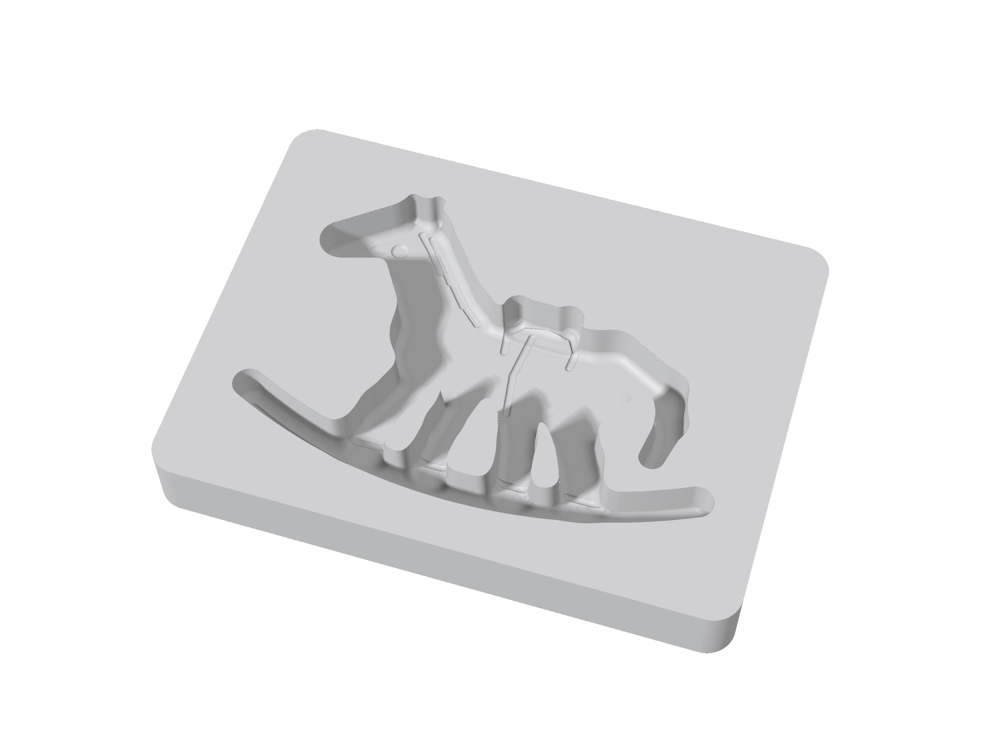

# Molde de chocolate — caballo mecedora

Placa rígida de una sola pieza con **una** cavidad negativa de caballo mecedora,
hundida bajo la cara superior. Molde abierto de una cara: da un bombón de dorso
plano, no una figura hueca.



---

## Cotas — medidas sobre la geometría, no sobre el brief

| Cota | Nominal | Medido |
|---|---|---|
| Placa exterior | 120 × 90 mm | **120.000 × 90.000 mm** |
| Espesor total | 15 mm | **15.000 mm** |
| Cavidad (caja de la silueta) | 100 × 70 mm | **100.000 × 70.000 mm** |
| Profundidad máxima | 10 mm | **10.000 mm** |
| Fondo sólido bajo la cavidad | 5 mm | **5.000 mm** |
| Margen perimetral | 10 mm | **10.0 mm** en los cuatro lados |
| Radio de esquinas exteriores | 6 mm | 6.0 mm |
| Redondeo de aristas interiores | 2 mm | 2.0 mm |
| Ángulo de salida de la pared | 3° | **3.00°** medidos entre Z = 12.9 y Z = 14.9 |

La cara superior es un plano exacto: la única interrupción es el contorno de la
cavidad. El fondo de la cavidad es plano a 9.5 mm de profundidad; los grabados
(ojo, ollar, sonrisa, mechones de melena, contorno de montura, cincha, línea de
cascos y franja de la base) bajan otros 0.5 mm hasta los 10 mm nominales, así
que salen **en relieve** sobre el chocolate.

El retiro total del contorno entre la boca y el fondo es de 2.05 mm: 0.52 mm de
los 3° de salida y el resto del radio interior de 2 mm.

## Compuertas de fabricabilidad

`python3 verificar_fabricabilidad.py`

```
[PASA] G1 sin socavados        0 celdas de hueco con material encima (de 3,235,261)
[PASA] G2 angulo de salida     3.00 grados medidos en la pared
[PASA] G3 pared minima         1.02 mm de plastico entre cavidades (p5 3.14)
[PASA] G4 grosor de la pieza   3.20 mm de chocolate en el punto mas fino (p5 6.36)
[PASA] G5 fondo solido         5.000 mm bajo el punto mas profundo
[PASA] G6 malla                cerrada, 1 cuerpo, euler 2, orientada, 132.93 cm3
```

**G1 es la compuerta que importa para desmoldar.** La cavidad es la
intersección de un prisma con salida hacia arriba y un semiespacio sobre el
fondo: por construcción no puede tener socavados, y la comprobación lo verifica
columna por columna sobre 3.2 millones de celdas de hueco. Sale sin forzar.

El punto de 1.02 mm de G3 es la cuña entre la panza y la pata trasera lejana;
es una arista rematada con radio, no una aleta suelta. El percentil 5 de las
paredes está en 3.1 mm.

## Archivos

| Archivo | Para qué |
|---|---|
| `molde-caballo-mecedora-120x90x15.3mf` | **el que se abre en Bambu Studio** |
| `molde-caballo-mecedora-120x90x15.stl` | cualquier otro slicer |
| `molde_sdf.py` | el modelo paramétrico (todas las cotas son constantes al inicio) |
| `generar_molde.py` | malla y exportación, con verificación por relectura |
| `verificar_fabricabilidad.py` | las seis compuertas |
| `render_molde.py` | los renders, trazados sobre el campo analítico |

`generar_molde.py` escribe además un `.obj` para render externo; no se versiona
porque no aporta nada sobre el STL.

Malla: 200 000 triángulos, cerrada, una sola pieza, euler 2, volumen
132.93 cm³. Sale de una malla de 28 M de vóxeles a 0.20 mm simplificada con
error cuadrático; la desviación contra las cotas nominales es 0.000 mm.

## Imprimir en Bambu Studio

Abre el `.3mf`. Ya viene apoyado sobre la cara de cama (Z = 0) y con la
cavidad hacia arriba: **no lo rotes**. En esa posición no hay un solo voladizo.

| Ajuste | Valor | Por qué |
|---|---|---|
| Boquilla | 0.4 mm | el detalle más fino son ranuras de 1.6 mm de ancho |
| Altura de capa | 0.16 mm (0.12 para más detalle) | las ranuras grabadas son de 0.5 mm de fondo |
| Perímetros (wall loops) | 4 | rigidez; el molde se flexiona al desmoldar |
| Capas superiores / inferiores | 6 / 4 | la cara superior tiene que quedar plana de verdad |
| Relleno | 25 %, gyroid | |
| Soportes | **ninguno** | G1: no hay socavados ni voladizos |
| Balsa / brim | ninguno | base plana de 120 × 90 mm |
| Detect thin walls | activado | para que la cuña de 1.02 mm se imprima |
| Velocidad de perímetro exterior | 80–100 mm/s | define el filo del contorno |
| Planchado (ironing) | solo cara superior | opcional, deja la cara superior de espejo |

Si te importa que el bombón mida exactamente 100 × 70, escala al **100.4 %**
para compensar la contracción del material; si no, imprime al 100 %.

Consumo y tiempo: **ESTIMADO**, no medido — aquí no hay slicer. Con esos
ajustes espera del orden de 55–70 cm³ de filamento (≈ 70–90 g de PLA) y entre
6 y 9 horas en una P1S. El número real lo da Bambu Studio al rebanar; no
mandes este rango a un cliente como si fuera una cotización.

## Material y uso con alimentos

El chocolate es anhidro, así que el riesgo microbiológico es bajo, pero una
pieza FDM tiene líneas de capa donde se acumula grasa. Dos caminos:

1. **Directo.** Imprime en PETG (o PP) de grado alimentario, lávalo a mano con
   agua tibia y dedícalo solo a chocolate. Evita el lavavajillas: el PLA se
   deforma arriba de 55 °C.
2. **Recomendado para producción.** Usa esta pieza como **modelo maestro** y
   cuela sobre ella silicona de platino de grado alimentario. El molde flexible
   resultante desmolda mucho mejor y sí es lavable.

Para desmoldar del molde rígido: templa el chocolate, viértelo, golpea la placa
contra la mesa para sacar el aire de las patas y de las orejas, enfría 15–20
minutos en refrigeración y voltea con un golpe seco.

Rendimiento por colada: cavidad de **28.6 cm³ ≈ 37 g** de chocolate.

## Cambiar el diseño

Todo es paramétrico. Las cotas viven al inicio de `molde_sdf.py`
(`PLATE_W`, `CAV_DEPTH`, `DRAFT_DEG`, `FILLET_R`…) y la silueta es una lista de
primitivas en `_horse_parts()`. La silueta se reescala sola para que su caja
mida exactamente `CAV_W × CAV_H`, así que puedes mover una pata sin recalcular
nada.

```bash
python3 generar_molde.py --res 0.20 --faces 200000   # malla + exportación
python3 verificar_fabricabilidad.py                  # las seis compuertas
python3 render_molde.py --w 1500 --ss 2              # los renders
```

Después de tocar la silueta, corre siempre `verificar_fabricabilidad.py`: G3 es
la que se rompe primero cuando dos partes del caballo se acercan.
